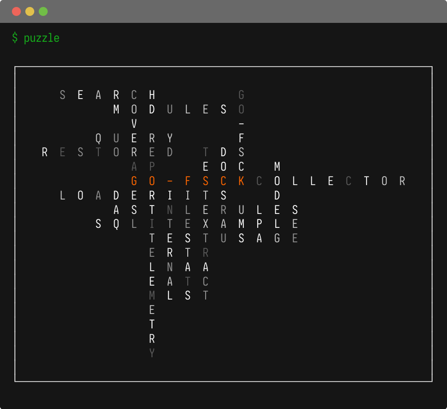

# tools - A collection of Go development tools and libraries

### [worktree](worktree/)

A workspace overview tool for Go module and git workspaces. Displays module dependencies, git state, local changes, untracked files, and GitHub issues in a formatted table. Supports filtering by path or module name, verbose output, and can render PlantUML or D2 dependency diagrams.


```
go install github.com/titpetric/tools/worktree@main
```

### [splint](splint/)

A data model of Go source, two parsers that fill it, and twelve linters over the top. The model imports no third party package, so a linter written against it links neither `go/ast` nor `x/tools`; one parser reads through `go/ast` and the other reads bytes, an order of magnitude quicker and tolerant of source that does not compile.

The linters cover file-test pairing, symbol-test coverage, symbol grouping by filename, HTTP handler wrappers, file size, visibility, godoc, import collisions, argument and return order, module dependencies, and what a file needs from the rest of its package.

```
go install github.com/titpetric/tools/splint@main
```

### [puzzle](puzzle/)

A creative tool that visualizes a Go repository's package structure as a crossword puzzle rendered in the terminal. Supports default and matrix rendering styles.



```
go install github.com/titpetric/tools/puzzle@main
```

### [semver](semver/)

A CLI tool that reads git tags from the local repository or `git ls-remote --tags` output from stdin, parses semver tags, and outputs the latest patch version for each minor release across the last two major versions as JSON.

```
go install github.com/titpetric/tools/semver@latest
```

## Development

Each module is an independent Go module. A root [atkins.yml](atkins.yml) is provided with:

- `atkins update` - Update Go version and dependencies across all modules
- `atkins list` - List all sub-module directories

## License

[MIT](LICENSE) - Copyright (c) 2025 Tit Petric
