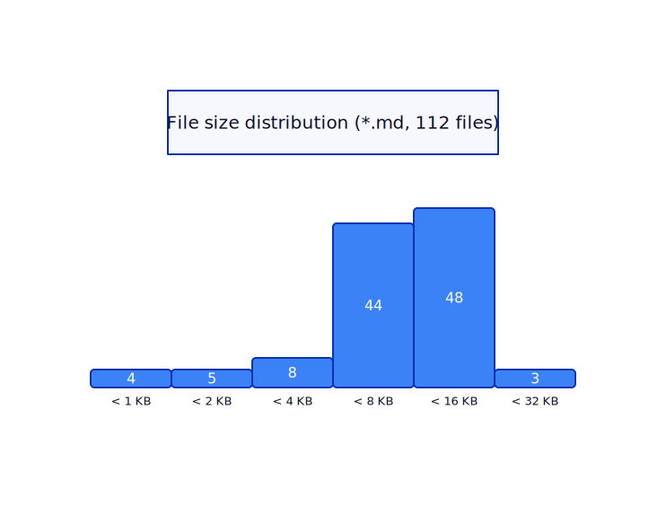
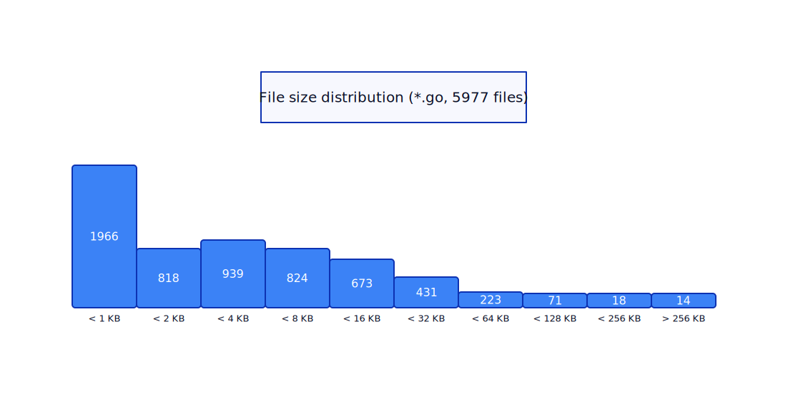
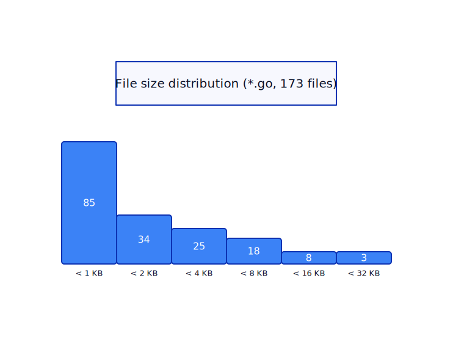
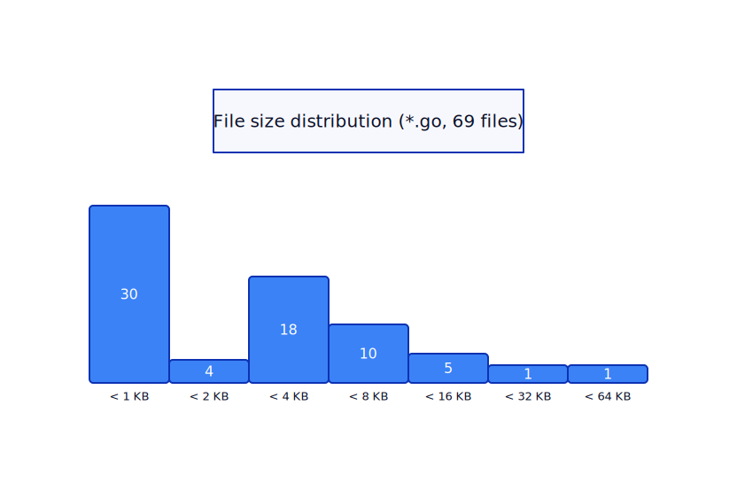

# filecheck - a file size statistics linter

The aim of the linter is to gauge complexity by filesize / file count.
This is driven by estimates of what kind of contexts humans handle well,
and the current LLM coding agents limitations.

## Markdown performance

| Cognitive Level | File Size  | Tokens  | Human          | Small LLM (≤7B CPU) | Mid LLM (13B–30B) | Agentic (Claude / Cursor) | Behavior                 |
| --------------- | ---------- | ------- | -------------- | ------------------- | ----------------- | ------------------------- | ------------------------ |
| **Low**         | 2–8 KB     | 1K–2K   | Ideal          | Excellent           | Excellent         | Excellent                 | Full comprehension       |
| **Moderate**    | 8–20 KB    | 2K–5K   | Comfortable    | Good                | Excellent         | Excellent                 | Reliable reasoning       |
| **High**        | 20–50 KB   | 5K–12K  | Upper bound    | Struggles           | Good              | Very good                 | Partial compression      |
| **Very High**   | 50–100 KB  | 12K–25K | Strained       | Poor                | Degraded          | Good                      | Summarization dominates  |
| **Extreme**     | 100–300 KB | 25K–75K | Not tractable  | Unusable            | Poor              | Partial                   | Retrieval-like reasoning |
| **Beyond**      | 300 KB+    | 75K+    | Reference only | —                   | —                 | Degraded                  | Search + extract only    |

As a benchmark, my technical blog and personal estimates tell me the above to be true.



## Coding performance

| Cognitive Level | File Size | SLOC     | Tokens  | Human              | Small LLM (≤7B CPU) | Mid LLM (13B–30B) | Agentic (Claude / Cursor) | Behavior               |
| --------------- | --------- | -------- | ------- | ------------------ | ------------------- | ----------------- | ------------------------- | ---------------------- |
| **Low**         | 2–6 KB    | 50–150   | 1K–3K   | Ideal              | Excellent           | Excellent         | Excellent                 | Full logical reasoning |
| **Moderate**    | 6–12 KB   | 150–300  | 3K–6K   | Comfortable        | Good                | Excellent         | Excellent                 | Reliable analysis      |
| **High**        | 12–20 KB  | 300–500  | 6K–10K  | Upper bound        | Struggles           | Good              | Very good                 | Misses edge cases      |
| **Very High**   | 20–40 KB  | 500–800  | 10K–16K | Strained           | Poor                | Degraded          | Good (partial)            | Dependency loss begins |
| **Extreme**     | 40–60 KB  | 800–1200 | 16K–25K | Not viable         | Unusable            | Poor              | Degraded                  | Local reasoning only   |
| **Beyond**      | 60 KB+    | 1200+    | 25K+    | Requires splitting | —                   | —                 | Weak                      | Fails without chunking |

### Go standard library



### Smaller applications

This is a human authored, tested and partitioned modular monolith codebase.



This is an unpublished, LLM authored DB administration tooling. Aside
prompting some file and folder structure, enforce linters, no real
measures have been taken to optimize for file size. Its agent emerged
from limited context and a screenshot of Lovable.



## Observations

- Most markdown files end up being in the same upper bounds as human comprehension.
- I've authored books, the **extreme** category is real when you have hundreds of pages to edit.
- My own rules generally aim for 10-20KB for both markdown and code.

Smaller models have limited context size, so text-oriented agentic
proofreader/editor that chunks articles for review and language updates
would have to consider splitting.

Agents do better with code, with progressive discovery they can read
code structure with better tools than `grep`, notably `go doc` for
packages and symbols, `gopls` for code structure and some typical
actions like moving or renaming symbols. It can reason by function
signature alone to sort a definition to a different file.

So, for best results, panic when you approach 20KB and split the files
into smaller files over time.

## Linter output

Linter basically sums all the files and gives a histogram of cognitive
levels required for individual files over the scope of a go module. It
reports two dimensions, simply:

```yaml
filecheck:
  scanned:
    - ext: .md
      files: 123
      histogram: [...]      # file size histogram, power of two KBs, 1,2,4,8,16,32...
    - ext: .go
      files: 105
      histogram: [...]
  report:
    rating: (sum of very high and over 16KB file sizes / sum of all filesizes) * 100.
```

The histogram sorts files by filesize into buckets. If there are no big
files, your rating is high. It still takes filesize into consideration
and not just rating for the individual file, if the file is 5x over
size, the ratio will be poor.

A known issue is that generated code may penalize the scanner. This
includes the old bindata, protobuf pb.go, grpc service definitions and
other tools that tend to generate everything into a single file.