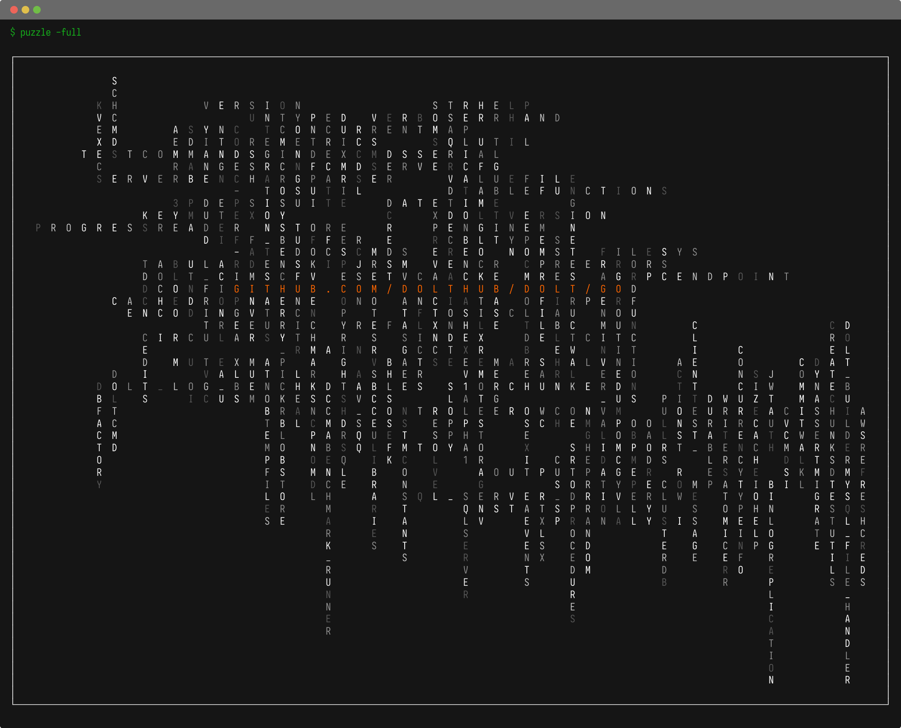
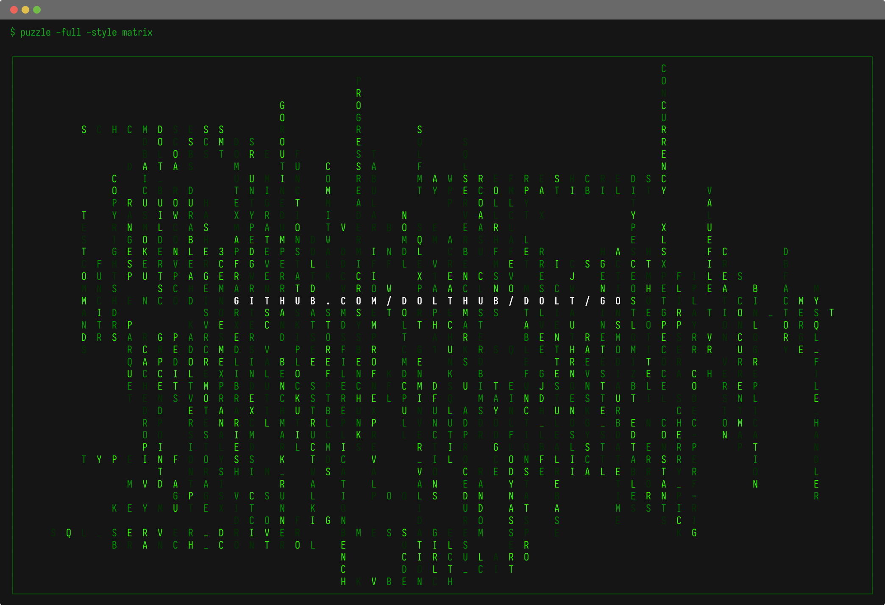
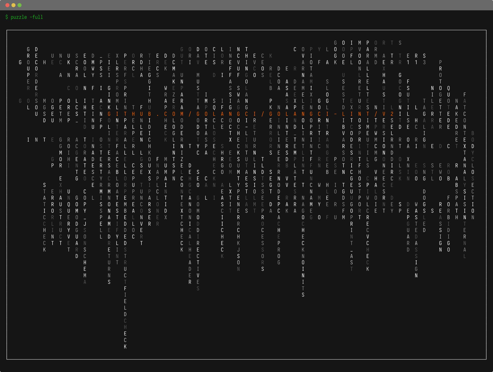
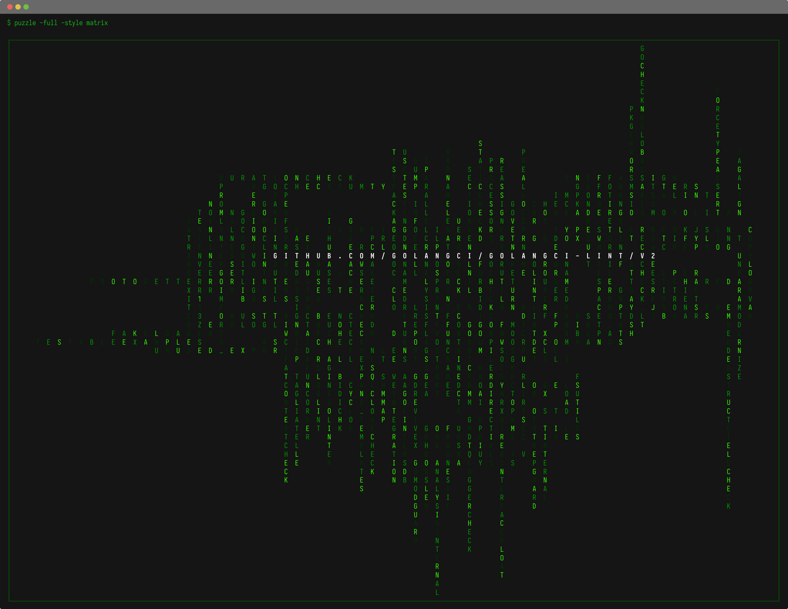
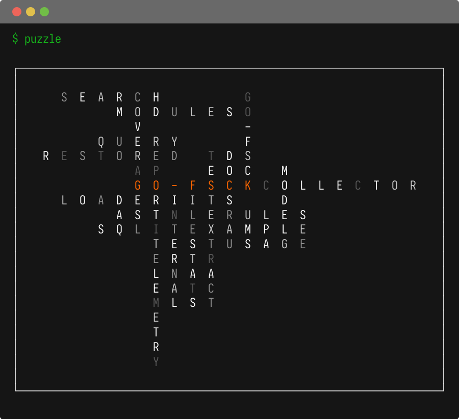
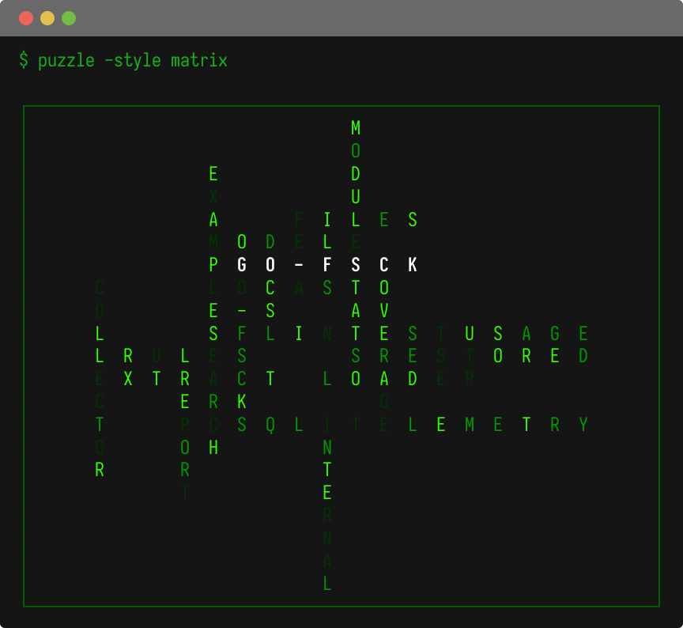

# Puzzle

This is a creative way to analyze a go repository package structure. The
tool basically creates a basic crossword puzzle (or tries to).

```bash
go install github.com/titpetric/tools/puzzle@main
```

Navigate into a project and run:

- `puzzle` - prints all packages
- `puzzle -full` - full root import path
- `puzzle -style matrix` - prints a greener version

## Examples













## Known defects

Sometimes the size of the packages requires passing `-width` and
`-height`. The default size of the output is 120 x 80 and complex
packages may need a larger size for the canvas. Rerunning it may help as
the output is non-deterministic (random sort).