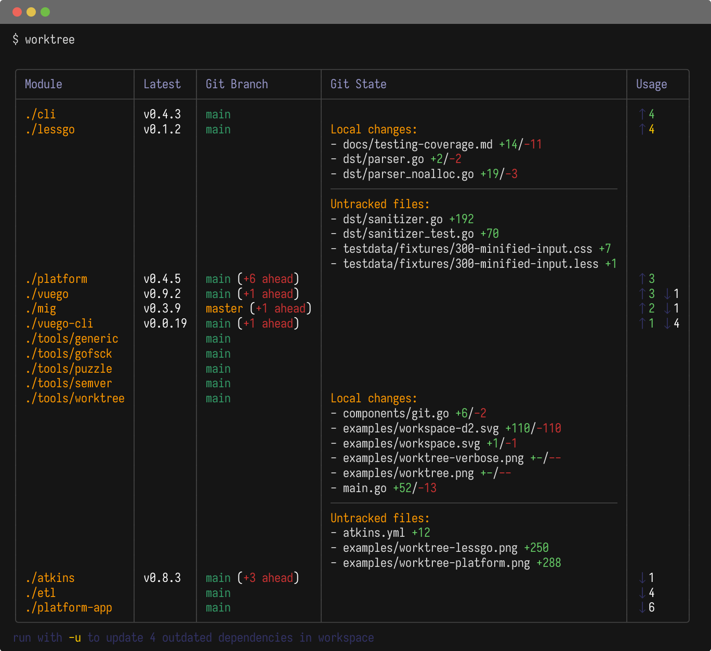
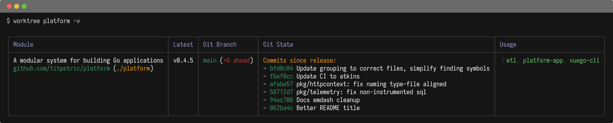
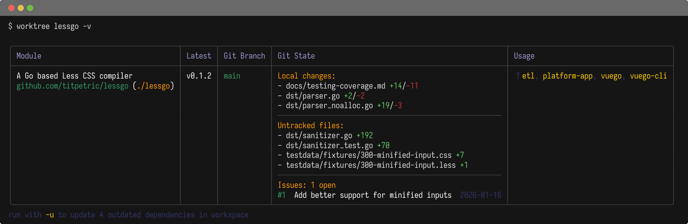
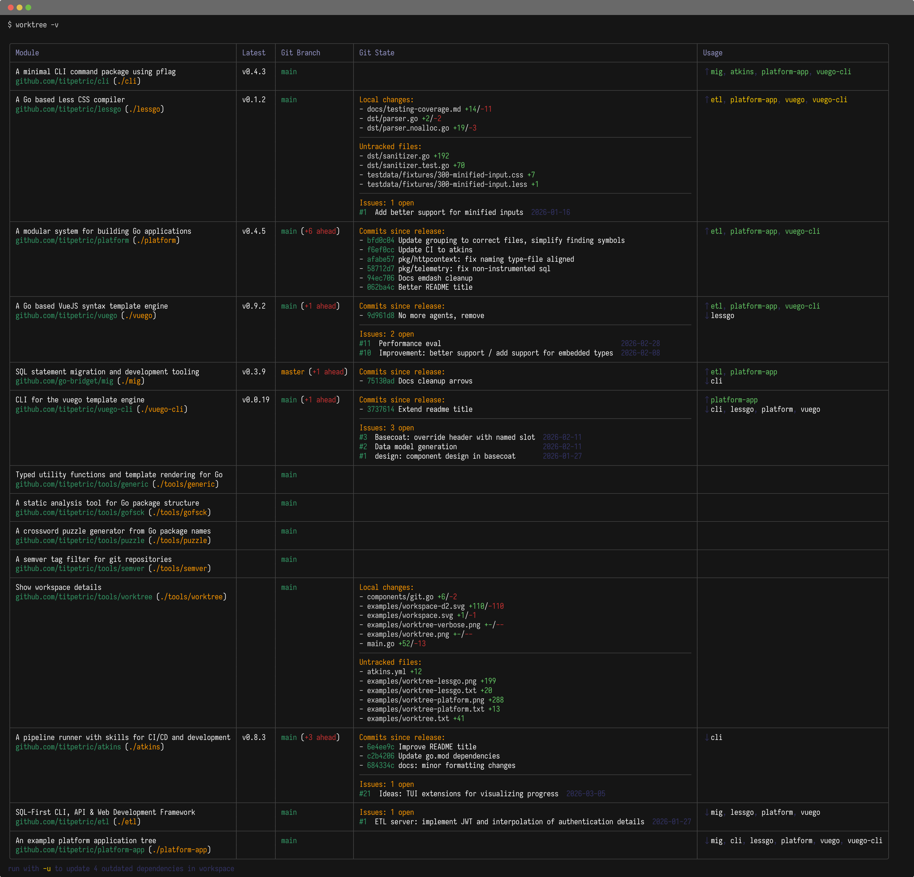
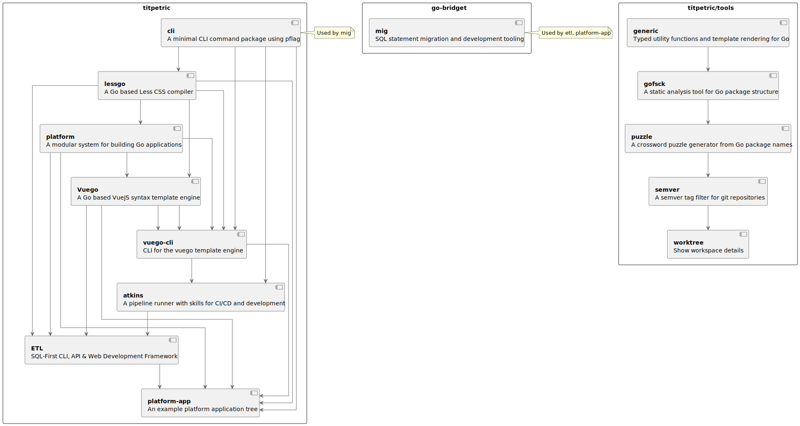

# worktree - Show workspace details



This is a tool for developers that:

- Use `git` workspaces
- Use `go` modules or go workspaces
- Use `gh issues` for issue tracking
- Need insight to their workspaces

The tool provides information and overview of the workspace state.

To install the tool:

```bash
go install github.com/titpetric/tools/worktree@main
```

Run `worktree` in your source workspace. An optional path argument filters
the output to modules matching that path:

```bash
worktree .           # show only the module in the current folder
worktree ./tools     # show all modules under the tools folder
worktree /abs/path   # show modules matching an absolute path
```

Several flags invoke tool functionality:

- `-v` gives a detailed verbose view with extra data,
- `-u` flag will update stale workspace dependencies, use latest go module versions,
- `-puml` will render a plantuml representation of the workspace,
- `-d2` will render a d2 representation of the workspace.

You can create a symlink to `git-st`.

```bash
cd /usr/local/bin
ln -s /usr/local/bin/worktree git-st
```

Creating the symlink enables running `git st` and `git st -v`.

## Information summarized

The tool scans and displays information about:

- Go module name
- Go module versions in use (for updates)
- Go module dependencies in workspace
- README.md title is read for the description
- Latest git version tag
- Git commits since version tag
- Git branch in source tree
- Unpushed git commits
- Local changes to source tree
- Untracked changes to source tree
- GitHub issues (gh issue list)

It's focused on summarizing of Go workspaces, or git checkouts of standalone
Go modules. Git support may be extended to better account for custom remotes
and checkouts that aren't a go module source tree.

## Examples

### Summary workspace view

The following screenshots show standard output, workspace filtering and
verbose output for the complete workspace.








### D2 Diagram


### PlantUML Diagram



## Why?

Using a go workspace is a relatively smooth experience, but most
software still gets built and delivered outside a workspace.

This process requires updating the go.mod dependencies as a new version
gets tagged. For each module in a workspace I'm interested in:

- using the latest release across the workspace in go.mod
- seeing any local changes not yet commited or pushed
- updating dependencies in the correct order

## Alternatives considered

For years now, I've been using `git st`, to get a recursive view of a
git source tree. I maintain a bash version of it in my dotfiles, as well
as had a php version eons ago. Let's consider this something like a v3
for the approach.

Git source trees don't give enough dependency information, so I wanted
something that reads in go.mod go.work files and provides relevant
information to you.

